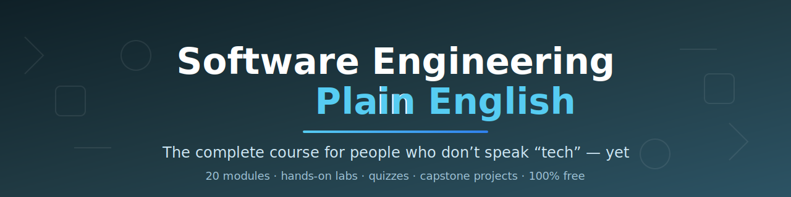

# 🌍 Software Engineering — The Easy Way

### Программная инженерия, объяснённая простыми словами

**Полный курс программной инженерии для тех, кто не говорит на «айтишном» — пока не говорит.**

*Не нужен опыт. Не нужен дорогой компьютер. Не нужен диплом математика.*

### 🌐 Поддержка разных языков

> Уроки переводит сообщество — главная страница курса уже доступна на всех языках
> из списка ниже, полные уроки на подходе. [Помогите с переводом!](../README.md)

[English](../../README.md) | [العربية (Arabic)](../ar/README.md) | [বাংলা (Bengali)](../bn/README.md) | [Deutsch (German)](../de/README.md) | [Español (Spanish)](../es/README.md) | [Français (French)](../fr/README.md) | [हिन्दी (Hindi)](../hi/README.md) | [Bahasa Indonesia (Indonesian)](../id/README.md) | [日本語 (Japanese)](../ja/README.md) | [Português (Portuguese)](../pt/README.md) | [Русский (Russian)](../ru/README.md) | [Kiswahili (Swahili)](../sw/README.md) | [தமிழ் (Tamil)](../ta/README.md) | [తెలుగు (Telugu)](../te/README.md) | [اردو (Urdu)](../ur/README.md) | [中文-简体 (Chinese, Simplified)](../zh/README.md)

> 🚧 Сами уроки пока на английском — эта главная страница переведена, чтобы вы могли увидеть, что вас ждёт. Помогите перевести уроки на ваш язык: [Как помочь с переводом](../README.md)

---

Если вы можете прочитать эту страницу — вы сможете пройти этот курс. К его концу вы будете
понимать, как на самом деле устроено программное обеспечение, напишете свои первые
программы, опубликуете настоящий сайт и сможете уверенно держаться в любом техническом
разговоре — всё объяснено простым человеческим языком, с аналогиями из повседневной жизни.

## 🤔 Для кого это?

- «Я каждый день пользуюсь приложениями, но **понятия не имею, как всё это на самом деле работает**».
- «Я работаю *с* инженерами (менеджер, дизайнер, основатель, юрист, врач…) и устал
  **просто кивать на совещаниях**».
- «Я хочу **сменить профессию и уйти в IT**, но каждый курс предполагает знания, которых у меня нет».
- «Мне просто **любопытно**, как устроен цифровой мир вокруг меня».

**Никаких предварительных требований нет** — мы объясняем всё, вплоть до того, что такое «файл (file)» на самом деле.

## 🎓 Чему вы научитесь

- Как на самом деле работают компьютеры, программы, интернет, базы данных (databases), облако (cloud) и ИИ.
- Как читать и писать простые программы на Python.
- Как пользоваться Git и GitHub как профессионал (вы опубликуете собственный работающий сайт).
- Как настоящие команды разработки планируют, создают, тестируют и выпускают продукты.
- Как говорить с инженерами на равных — API, серверы (servers), баги (bugs), деплои (deploys) и спринты (sprints) — всё расшифровано.

**Чего здесь не будет:** высшей математики, узкоспециальных корпоративных инструментов и
пустой шумихи. У каждой аналогии честно указано, где она перестаёт работать, а модуль про ИИ
откровенно говорит о его ограничениях.

## 🚀 С чего начать

1. **⭐ Поставьте звезду (star) этому репозиторию**, чтобы легко найти дорогу обратно.
2. Прочитайте **[START HERE](../../START_HERE.md)** (5 минут) — как устроен курс и какие
   бесплатные браузерные (browser) инструменты вам понадобятся. **Устанавливать ничего не нужно.**
   Каждая лабораторная работает прямо в браузере, даже на телефоне.
3. Начните с [модуля 01](../../modules/01-what-is-a-computer/README.md) — или выберите короткий
   путь в **[маршрутах обучения](../../LEARNING_PATHS.md)** («У меня есть только выходные»,
   «Я руковожу инженерами», «Меня интересует только ИИ»…).
4. Споткнулись о незнакомое слово? **[Словарь](../../GLOSSARY.md)** объясняет каждый термин одним простым предложением.

> **Преподавателям и учебным группам:** всё можно свободно использовать по [лицензии](../../LICENSE).
> Сделайте форк (fork) репозитория и адаптируйте его под свой класс.

## 📚 Программа курса

Каждый модуль содержит **урок** на простом языке, браузерную **лабораторную**, **тест** для
самопроверки и подборку бесплатных **дополнительных материалов**. Идите сверху вниз —
каждый модуль опирается на предыдущий.

| # | Модуль | Урок | Лаб | Тест | Extras |
| :-: | :------- | :-: | :-: | :-: | :-: |
| **I** | **Машина** 🖥️ — *что внутри светящегося прямоугольника* | | | | |
| 01 | Что такое компьютер на самом деле? | [Урок](../../modules/01-what-is-a-computer/README.md) | [Лаб](../../modules/01-what-is-a-computer/lab.md) | [Тест](../../modules/01-what-is-a-computer/quiz.md) | [Ссылки](../../modules/01-what-is-a-computer/resources.md) |
| 02 | Что такое программное обеспечение (software)? | [Урок](../../modules/02-what-is-software/README.md) | [Лаб](../../modules/02-what-is-software/lab.md) | [Тест](../../modules/02-what-is-software/quiz.md) | [Ссылки](../../modules/02-what-is-software/resources.md) |
| 03 | Как работает интернет | [Урок](../../modules/03-how-the-internet-works/README.md) | [Лаб](../../modules/03-how-the-internet-works/lab.md) | [Тест](../../modules/03-how-the-internet-works/quiz.md) | [Ссылки](../../modules/03-how-the-internet-works/resources.md) |
| **II** | **Мыслить как инженер** 🧠 — *образ мышления — это 80% работы* | | | | |
| 04 | Как думать как программист | [Урок](../../modules/04-think-like-a-programmer/README.md) | [Лаб](../../modules/04-think-like-a-programmer/lab.md) | [Тест](../../modules/04-think-like-a-programmer/quiz.md) | [Ссылки](../../modules/04-think-like-a-programmer/resources.md) |
| 05 | Ваш первый код (Python, прямо в браузере) | [Урок](../../modules/05-your-first-code/README.md) | [Лаб](../../modules/05-your-first-code/lab.md) | [Тест](../../modules/05-your-first-code/quiz.md) | [Ссылки](../../modules/05-your-first-code/resources.md) |
| 06 | Данные (data): новая нефть мира | [Урок](../../modules/06-data/README.md) | [Лаб](../../modules/06-data/lab.md) | [Тест](../../modules/06-data/quiz.md) | [Ссылки](../../modules/06-data/resources.md) |
| **III** | **Как создаётся настоящий софт** 🏗️ — *от стикера на мониторе до магазина приложений* | | | | |
| 07 | От идеи до приложения: жизненный цикл разработки ПО (software development lifecycle) | [Урок](../../modules/07-idea-to-app/README.md) | [Лаб](../../modules/07-idea-to-app/lab.md) | [Тест](../../modules/07-idea-to-app/quiz.md) | [Ссылки](../../modules/07-idea-to-app/resources.md) |
| 08 | Git и GitHub: машина времени для командной работы | [Урок](../../modules/08-git-and-github/README.md) | [Лаб](../../modules/08-git-and-github/lab.md) | [Тест](../../modules/08-git-and-github/quiz.md) | [Ссылки](../../modules/08-git-and-github/resources.md) |
| 09 | Почему софт ломается: баги (bugs), тестирование и качество | [Урок](../../modules/09-bugs-and-testing/README.md) | [Лаб](../../modules/09-bugs-and-testing/lab.md) | [Тест](../../modules/09-bugs-and-testing/quiz.md) | [Ссылки](../../modules/09-bugs-and-testing/resources.md) |
| 10 | Анатомия приложения: фронтенд (frontend), бэкенд (backend) и API | [Урок](../../modules/10-anatomy-of-an-app/README.md) | [Лаб](../../modules/10-anatomy-of-an-app/lab.md) | [Тест](../../modules/10-anatomy-of-an-app/quiz.md) | [Ссылки](../../modules/10-anatomy-of-an-app/resources.md) |
| **IV** | **Computer Science без страшной математики** 🔬 — *знаменитые идеи, по-человечески* | | | | |
| 11 | Алгоритмы (algorithms) и структуры данных простыми словами | [Урок](../../modules/11-algorithms-and-data-structures/README.md) | [Лаб](../../modules/11-algorithms-and-data-structures/lab.md) | [Тест](../../modules/11-algorithms-and-data-structures/quiz.md) | [Ссылки](../../modules/11-algorithms-and-data-structures/resources.md) |
| 12 | Базы данных (databases): где всё живёт | [Урок](../../modules/12-databases/README.md) | [Лаб](../../modules/12-databases/lab.md) | [Тест](../../modules/12-databases/quiz.md) | [Ссылки](../../modules/12-databases/resources.md) |
| 13 | Операционные системы (operating systems) и сети (networks): невидимые управляющие | [Урок](../../modules/13-operating-systems-and-networks/README.md) | [Лаб](../../modules/13-operating-systems-and-networks/lab.md) | [Тест](../../modules/13-operating-systems-and-networks/quiz.md) | [Ссылки](../../modules/13-operating-systems-and-networks/resources.md) |
| 14 | Безопасность (security): замки, ключи и цифровая самооборона | [Урок](../../modules/14-security/README.md) | [Лаб](../../modules/14-security/lab.md) | [Тест](../../modules/14-security/quiz.md) | [Ссылки](../../modules/14-security/resources.md) |
| **V** | **Современный мир софта** ☁️ — *модные словечки, расшифрованные* | | | | |
| 15 | Облако (cloud): аренда чужих компьютеров | [Урок](../../modules/15-the-cloud/README.md) | [Лаб](../../modules/15-the-cloud/lab.md) | [Тест](../../modules/15-the-cloud/quiz.md) | [Ссылки](../../modules/15-the-cloud/resources.md) |
| 16 | ИИ и машинное обучение (machine learning) без шумихи | [Урок](../../modules/16-ai-without-the-hype/README.md) | [Лаб](../../modules/16-ai-without-the-hype/lab.md) | [Тест](../../modules/16-ai-without-the-hype/quiz.md) | [Ссылки](../../modules/16-ai-without-the-hype/resources.md) |
| 17 | Сайты, приложения и всё остальное | [Урок](../../modules/17-websites-apps-and-beyond/README.md) | [Лаб](../../modules/17-websites-apps-and-beyond/lab.md) | [Тест](../../modules/17-websites-apps-and-beyond/quiz.md) | [Ссылки](../../modules/17-websites-apps-and-beyond/resources.md) |
| **VI** | **Люди и карьеры** 🧑‍🤝‍🧑 — *софт делают люди* | | | | |
| 18 | Кто чем занимается в IT | [Урок](../../modules/18-who-does-what-in-tech/README.md) | [Лаб](../../modules/18-who-does-what-in-tech/lab.md) | [Тест](../../modules/18-who-does-what-in-tech/quiz.md) | [Ссылки](../../modules/18-who-does-what-in-tech/resources.md) |
| 19 | Ваш путь в IT | [Урок](../../modules/19-your-path-into-tech/README.md) | [Лаб](../../modules/19-your-path-into-tech/lab.md) | [Тест](../../modules/19-your-path-into-tech/quiz.md) | [Ссылки](../../modules/19-your-path-into-tech/resources.md) |
| **🏆** | **Дипломный проект (capstone): создайте что-то настоящее** | [Обзор](../../capstone/README.md) | [Трек A: сайт](../../capstone/track-a-personal-website.md) · [Трек B: побудьте PM](../../capstone/track-b-be-the-pm.md) · [Трек C: автоматизируйте](../../capstone/track-c-automate-your-life.md) | — | [Витрина](../../capstone/showcase.md) |

## 📝 Тесты и лабораторные

- **Тесты** лежат в папке каждого модуля (`quiz.md`) — ответы спрятаны под спойлерами
  «Show answer», а каждый тест заканчивается заданием *«объясните это другу»*.
- **Лабораторные** (`lab.md`) — это практика, и для них **ничего не нужно устанавливать** —
  только бесплатные браузерные инструменты, удобные даже на телефоне. Именно на лабораторных знания и закрепляются.

## 🗺️ Справочные страницы курса

| Страница | Для чего она |
|---|---|
| [START HERE](../../START_HERE.md) | Как пользоваться курсом, расписания, три нужных вам инструмента |
| [Словарь](../../GLOSSARY.md) | Каждый технический термин курса — одним простым предложением |
| [Маршруты обучения](../../LEARNING_PATHS.md) | Короткие пути: спринт на выходных, трек для менеджеров, «интересен только ИИ», основатель… |
| [FAQ](../../FAQ.md) | Честные ответы: «Не поздно ли мне?», «Нужна ли математика?», сроки |
| [Гайд по стилю](../../docs/style-guide.md) | Правила письма, которым следует каждый урок |
| [Заметки о дизайне курса](../../docs/course-design.md) | Почему курс устроен именно так |
| [Отчёт об аудите](../../docs/audit-report.md) | Курс глазами нетехнического читателя |

## 🎒 Доступ офлайн

Склонируйте (clone) репозиторий (модуль 08 научит как) — и всё: уроки, лабораторные, тесты —
будет работать офлайн как обычный текст. Интернет нужен только для внешних ссылок и
браузерных лабораторных.

## 🤝 Участие и сообщество

Наткнулись на непонятное предложение? **Это баг в нашем курсе, а не в вашей голове** — пожалуйста,
[создайте issue](https://github.com/thetpmguy/software-engineering-in-english/issues) или пришлите
исправление: см. [CONTRIBUTING](../../CONTRIBUTING.md). Переводы — самый желанный вклад из всех:
см. [гид по переводам](../README.md). Тем, кто дошёл до конца: добавьте себя в
[витрину дипломных проектов](../../capstone/showcase.md) — заодно это станет вашим первым pull request.

## 📄 Лицензия

Бесплатно для всех и навсегда — см. [LICENSE](../../LICENSE).

**Сделано для миллиардов умных людей, которым индустрия софта забыла объяснить саму себя.**

*Если курс вам помог — поставьте репозиторию ⭐ звезду, чтобы его нашли и другие.*

